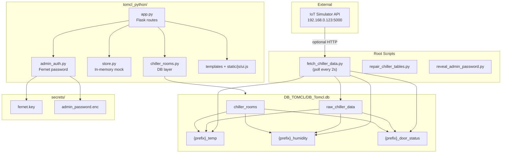

# TOMCL Cold Chain — System Knowledge & Concepts

This document explains **how the entire Tomcl Package works**: architecture, data flow, database design, Python modules, UI layers, security, and operational concepts. Use it as the main reference for understanding or extending the system.

---

## Table of Contents

1. [What This System Does](#1-what-this-system-does)
2. [High-Level Architecture](#2-high-level-architecture)
3. [Project Structure](#3-project-structure)
4. [Core Concepts](#4-core-concepts)
5. [Data Flow (End to End)](#5-data-flow-end-to-end)
6. [Database Design](#6-database-design)
7. [Python Modules Explained](#7-python-modules-explained)
8. [Flask Dashboard (UI)](#8-flask-dashboard-ui)
9. [Authentication & Roles](#9-authentication--roles)
10. [Change-Only Write Logic](#10-change-only-write-logic)
11. [Live Data vs Mock Data](#11-live-data-vs-mock-data)
12. [Utility Scripts](#12-utility-scripts)
13. [How to Run Everything](#13-how-to-run-everything)
14. [Common Issues & Fixes](#14-common-issues--fixes)
15. [Glossary](#15-glossary)

---

## 1. What This System Does

**TOMCL Cold Chain** monitors refrigerated storage units (“chillers”) for a meat cold-chain operation. It tracks:

- **Temperature** (°C)
- **Humidity** (%)
- **Door status** (open/closed, duration, alarms)
- **Defrost cycles** (from API raw data)
- **Batch inventory** (cargo stored per chiller — demo/in-memory)
- **Admin configuration** (rooms, sensors, users, thresholds)

The system has three main layers:

| Layer | Purpose |
|-------|---------|
| **Data fetcher** | Polls an IoT simulator/API and writes readings into SQLite |
| **SQLite database** | Single source of truth for telemetry and chiller room registry |
| **Flask dashboard** | Web UI for operators and admins to view and manage the system |

---

## 2. High-Level Architecture



**Key idea:** Everything persistent lives in **one SQLite file** (`DB_Tomcl.db`). The fetcher and Flask app both use `chiller_rooms.py` to talk to that database. Operational demo data (batches, users, alerts) lives in memory via `store.py`.

---

## 3. Project Structure

```
Tomcl Package/
│
├── fetch_chiller_data.py       # Background poller: API → raw → subtables
├── repair_chiller_tables.py    # Creates missing subtables for existing rooms
├── reveal_admin_password.py    # Decrypts admin password (recovery only)
│
├── DB_TOMCL/
│   ├── DB_Tomcl.db             # Single SQLite database (all telemetry + registry)
│   ├── DB_Tomcl.sqbpro         # DB Browser project file
│   └── tomcl_write.lock        # Runtime lock when admin is writing (optional)
│
├── secrets/                    # Outside application code (security)
│   ├── fernet.key              # Encryption key for admin password
│   ├── admin_password.enc      # Encrypted admin password blob
│   └── PASSWORD_RECOVERY.txt   # Human recovery instructions
│
└── tomcl_python/               # Flask web dashboard
    ├── app.py                  # Routes, sessions, role switching
    ├── store.py                # In-memory data (batches, users, alerts, settings)
    ├── chiller_rooms.py        # SQLite: rooms, subtables, telemetry queries
    ├── admin_auth.py           # Admin password gate (@require_admin)
    ├── requirements.txt        # flask, cryptography
    ├── static/
    │   ├── css/custom.css      # Chiller card styles, splash, animations
    │   ├── js/ui.js            # Sidebar, filters, Chart.js, modals
    │   └── img/TOMCL-Logo.jpeg
    └── templates/              # Jinja2 HTML pages (12 templates)
        ├── base.html           # App shell (sidebar, navbar, splash)
        ├── overview.html       # Chiller device cards grid
        ├── detail.html         # Analytics + Chart.js telemetry
        ├── batches.html        # Inventory & dispatch
        ├── alerts.html         # Static alert log table
        ├── settings.html       # Threshold configuration
        ├── admin_login.html    # Admin password gate
        ├── admin_overview.html # Admin KPI dashboard
        ├── chiller_rooms.html  # Create/delete chiller rooms
        ├── device_config.html  # IoT gateways, sensors, calibration
        ├── users.html          # User CRUD (mock)
        └── audit_logs.html     # Security audit (mock)
```

---

## 4. Core Concepts

### 4.1 Chiller Room

A **chiller room** is a registered cold-storage unit in the system (e.g. `"Chiller 1"`). When an admin creates a room:

1. A row is inserted into `chiller_rooms` (registry).
2. Three **subtables** are created automatically:
   - `{prefix}_temp`
   - `{prefix}_humidity`
   - `{prefix}_door_status`

The **table prefix** is derived from the name: `"Chiller 1"` → `Chiller_1`.

### 4.2 Raw vs Subtables

| Table | Role |
|-------|------|
| **`raw_chiller_data`** | Staging area — every *changed* API reading as a full snapshot row |
| **`{prefix}_temp`** | Normalized temperature history (one row per change) |
| **`{prefix}_humidity`** | Normalized humidity history (one row per change) |
| **`{prefix}_door_status`** | Door events (unlock row → lock row + duration) |

The fetcher always tries to **distribute from raw into subtables**, even when the API is offline.

### 4.3 Single Database Rule

All chiller data must live in **`DB_TOMCL/DB_Tomcl.db`**. There is no separate registry database in production (legacy `chiller_registry.db` was migrated and removed).

### 4.4 Two UI Modes

- **Operational Manager** — day-to-day monitoring (overview, analytics, batches, alerts).
- **System Admin** — configuration (rooms, users, IoT, audit). Requires password.

### 4.5 Fetcher Independence

`fetch_chiller_data.py` runs **outside** `tomcl_python/`. It imports `chiller_rooms` from that folder but is started as its own process. This keeps polling separate from the web server.

---

## 5. Data Flow (End to End)

### Step 1 — Admin creates a chiller room

```
Browser → POST /device-config/create-room (or /chiller-rooms)
       → register_chiller_room("Chiller 1")
       → INSERT chiller_rooms
       → CREATE Chiller_1_temp, Chiller_1_humidity, Chiller_1_door_status
```

### Step 2 — Fetcher polls (every 2 seconds)

```
fetch_chiller_data.py → poll_once()
```

Inside `poll_once()`:

1. **Skip** if admin write lock is held (`tomcl_write.lock`).
2. **Optional live fetch:** `GET http://192.168.0.123:5000/api/dashboard`  
   Fallback: `/api/readings?limit=1`
3. **Compare** new reading to last raw row for that chiller → **insert only if changed**.
4. **Always distribute:** Read all `raw_chiller_data` rows matching the room → replay through `apply_reading_to_room()`.

### Step 3 — Dashboard reads live metrics

```
/overview → list_chiller_rooms() → latest_live_metrics(prefix)
         → temp, humidity, doorOpen on chiller cards

/detail   → telemetry_from_subtables(chiller, date, range)
         → Chart.js line chart + door event logs
```

### Offline behavior

If the API at `192.168.0.123:5000` is down:

- Fetcher logs `API unreachable` and continues.
- Distribution still runs from **existing** `raw_chiller_data` rows.
- Dashboard still shows data already in subtables.

---

## 6. Database Design

### 6.1 Registry: `chiller_rooms`

| Column | Type | Description |
|--------|------|-------------|
| `id` | INTEGER PK | Auto-increment room ID |
| `name` | TEXT UNIQUE | Display name, e.g. `"Chiller 1"` |
| `table_prefix` | TEXT UNIQUE | Subtable prefix, e.g. `"Chiller_1"` |
| `created_at` | TEXT | ISO timestamp |

### 6.2 Staging: `raw_chiller_data`

Stores full API snapshots. Key columns:

| Column | Description |
|--------|-------------|
| `chiller_id` | Links to room name (e.g. `"Chiller 1"`) |
| `timestamp` | Reading time |
| `temperature_c` | Temperature |
| `humidity_percent` | Humidity |
| `door_status` | `unlocked` / `locked` / `open` / `closed` |
| `defrost_active` | Defrost flag from API |
| `chiller_status` | General status string |

### 6.3 Per-chiller subtables

**`{prefix}_temp`**

| Column | Description |
|--------|-------------|
| `Date` | Date portion |
| `time_stamp` | Time portion |
| `temp` | Temperature value |

**`{prefix}_humidity`**

| Column | Description |
|--------|-------------|
| `Date` | Date portion |
| `time_stamp` | Time portion |
| `humidity` | Humidity value |

**`{prefix}_door_status`**

| Column | Description |
|--------|-------------|
| `Date` | Event date |
| `time_stamp_unlocked` | When door opened |
| `time_stamp_locked` | When door closed (NULL while open) |
| `duration` | How long door was open |

### 6.4 Relationships (logical)

```
chiller_rooms (1) ──► (N) raw_chiller_data     [match by chiller_id / name / prefix]
chiller_rooms (1) ──► (1) {prefix}_temp
chiller_rooms (1) ──► (1) {prefix}_humidity
chiller_rooms (1) ──► (1) {prefix}_door_status
```

SQLite does not enforce foreign keys; matching is by naming convention and string IDs.

### 6.5 Concurrency settings

- **WAL journal mode** — allows concurrent reads while writing.
- **`busy_timeout`** — retries when database is locked.
- **`tomcl_write.lock`** — file lock so fetcher pauses during admin writes.
- Close **DB Browser** before admin create/delete to avoid long locks.

---

## 7. Python Modules Explained

### 7.1 `fetch_chiller_data.py` (root)

**Purpose:** Background data pipeline.

| Function | What it does |
|----------|--------------|
| `fetch_snapshot()` | GET JSON from simulator API |
| `normalize_row()` | Maps API fields to DB column names |
| `raw_changed()` | Compares all tracked fields; skip duplicate raw inserts |
| `try_fetch_and_append_raw()` | Live path: API → `raw_chiller_data` |
| `distribute_from_existing_raw()` | Offline path: raw → subtables for every room |
| `poll_once()` | One cycle: optional fetch + always distribute |
| `main()` | Loop every `POLL_SECONDS` (2s) |

**Constants:**

- `SOURCE_BASE = "http://192.168.0.123:5000"`
- `DB_PATH = DB_TOMCL/DB_Tomcl.db`

---

### 7.2 `tomcl_python/chiller_rooms.py`

**Purpose:** Database access layer — the brain of persistence.

| Function | What it does |
|----------|--------------|
| `register_chiller_room(name)` | Create registry row + 3 subtables |
| `delete_chiller_room(id)` | Drop subtables + delete registry row |
| `list_chiller_rooms()` | Return all registered rooms (cached ~1.5s) |
| `apply_reading_to_room(conn, prefix, reading)` | **Change-only** write to temp/humidity/door tables |
| `latest_live_metrics(prefix)` | Latest temp, humidity, door open flag for overview cards |
| `telemetry_from_subtables(chiller, date, range)` | Chart data for 24h / 7 Days / 30 Days |
| `connect()` | SQLite connection with WAL + busy timeout |
| `acquire_write_lock()` / `release_write_lock()` | Admin write coordination |

**Name slugging:** `"Chiller 1"` → prefix `Chiller_1` (spaces → underscores).

---

### 7.3 `tomcl_python/app.py`

**Purpose:** Flask web server and routing.

- Runs on **http://127.0.0.1:5000**
- On startup: `STORE.sync_from_rooms(list_chiller_rooms())` — syncs in-memory chiller list from DB.
- **`nav_context(active_tab)`** — builds sidebar menu based on role.
- **Operational routes:** `/overview`, `/detail`, `/batches`, `/alerts`, `/settings`
- **Admin routes:** `/admin`, `/users`, `/device-config`, `/chiller-rooms`, `/audit-logs` (all `@require_admin`)
- **Session:** `role`, `admin_authenticated`

---

### 7.4 `tomcl_python/store.py`

**Purpose:** In-memory application state (mirrors original React `AppContext`).

| Data | Persisted? |
|------|------------|
| `chillers` | Synced from DB rooms (not written back) |
| `batches` | In-memory only |
| `users` | In-memory only |
| `notifications` | In-memory only |
| `settings` | In-memory only |
| `ALERT_LOGS`, `AUDIT_LOGS`, `GATEWAYS` | Static mock constants |

**Note:** `telemetry_for()` in this file is **legacy mock chart data** from the original React app. The Flask app now uses `telemetry_from_subtables()` from `chiller_rooms.py` for real charts.

---

### 7.5 `tomcl_python/admin_auth.py`

**Purpose:** Secure admin access without storing plaintext password in code.

```
secrets/fernet.key          → Fernet encryption key
secrets/admin_password.enc  → Encrypted password blob
```

| Function | What it does |
|----------|--------------|
| `verify_admin_password(password)` | Decrypt expected password and compare |
| `@require_admin` | Decorator: redirect to `/admin/login` if not authenticated |
| `admin_authenticated()` | Check session flags |

Recovery: run `python reveal_admin_password.py` or read `secrets/PASSWORD_RECOVERY.txt`.

---

## 8. Flask Dashboard (UI)

### 8.1 Technology stack

| Piece | Technology |
|-------|------------|
| Server | Flask (Python) |
| Templates | Jinja2 HTML |
| Styling | Tailwind CSS v4 (CDN) + `custom.css` |
| Icons | Lucide (CDN) |
| Charts | Chart.js 4 (detail page) |
| Font | Source Sans 3 |

### 8.2 App shell (`base.html`)

Shared layout for all pages except admin login:

- **Splash screen** — first visit only (2.4s, `sessionStorage`)
- **Sidebar** — role switcher + navigation
- **Navbar** — logo, notifications, user badge
- **Main content** — page-specific block
- **Toast** — flash success messages (auto-dismiss 3.5s)

Client behavior lives in `static/js/ui.js`:

- Sidebar open/close (`localStorage`)
- Overview filter pills + search
- Detail page Chart.js dual-axis chart
- Batch modals, user modals, multiselects

### 8.3 Pages and routes

| Page | Route | Role | Data source |
|------|-------|------|-------------|
| Dashboard Overview | `/overview` | Operational | Live DB subtables |
| Chiller Analytics | `/detail/<id>` | Operational | Live DB subtables |
| Batches & Inventory | `/batches` | Operational | In-memory `STORE` |
| Alerts & Reports | `/alerts` | Operational | Static `ALERT_LOGS` |
| System Settings | `/settings` | Both | In-memory `STORE.settings` |
| Admin Login | `/admin/login` | Gate | Fernet password |
| Admin Overview | `/admin` | Admin | DB rooms + mock KPIs |
| Chiller Rooms | `/chiller-rooms` | Admin | DB `chiller_rooms` |
| User Management | `/users` | Admin | In-memory users |
| IoT & Sensors Config | `/device-config` | Admin | DB + mock gateways |
| Audit & Security Logs | `/audit-logs` | Admin | Static `AUDIT_LOGS` |

### 8.4 Signature UI: Chiller Device Card

The overview page uses custom CSS classes in `custom.css`:

- `.chiller-device-card` — card container with hover animation
- `.chiller-device-halo` — colored glow (blue / red alarm / amber defrost)
- `.chiller-device-dock` — blue bottom section with door + status
- `.device-switch` — pill toggle showing Normal / Alarm / Defrost

State is driven by: `isAlarm` (door open), `isDefrosting`, live temp/humidity from DB.

---

## 9. Authentication & Roles

### 9.1 Operational mode (no password)

- Default mode for floor staff.
- Full access to overview, analytics, batches, alerts, settings.
- Cannot create/delete chiller rooms or manage users.

### 9.2 Admin mode (password required)

Flow:

```
User selects "System Admin" in sidebar
    → POST /set-role (role=admin)
    → Redirect to /admin/login

User enters password
    → verify_admin_password() using Fernet secrets
    → session["admin_authenticated"] = True
    → Redirect to /admin

Any @require_admin route without auth
    → Redirect to /admin/login?next=<path>
```

### 9.3 Session keys

| Key | Values | Meaning |
|-----|--------|---------|
| `role` | `"operational"` or `"admin"` | Selected mode |
| `admin_authenticated` | `True` / absent | Password verified |

If `role=admin` but not authenticated, UI falls back to operational menu.

---

## 10. Change-Only Write Logic

The system avoids duplicate rows when values have not changed. This happens at **two layers**.

### Layer 1 — Raw table (`fetch_chiller_data.py`)

Before inserting into `raw_chiller_data`, compare all fields in `COMPARE_FIELDS`:

- timestamp, chiller_status, defrost_active, door_status, temperature_c, humidity_percent, etc.
- **Insert only if any field differs** from the previous row for that `chiller_id`.

### Layer 2 — Subtables (`apply_reading_to_room()`)

| Metric | Rule |
|--------|------|
| **Temperature** | INSERT into `{prefix}_temp` only if `temperature_c` ≠ last stored temp |
| **Humidity** | INSERT into `{prefix}_humidity` only if `humidity_percent` ≠ last stored humidity |
| **Door unlocked** | INSERT new door row when status changes **to** unlocked/open |
| **Door locked** | UPDATE open door row: set `time_stamp_locked` + compute `duration` |

Door normalization:

- `unlocked`, `open` → treated as **unlocked**
- `locked`, `closed` → treated as **locked**

**Why this matters:** Reduces database size, makes charts meaningful (one point per actual change), and matches real sensor behavior.

---

## 11. Live Data vs Mock Data

| Feature | Source | Persisted to DB? |
|---------|--------|------------------|
| Chiller room registry | SQLite `chiller_rooms` | Yes |
| Temperature / humidity history | SQLite subtables | Yes |
| Door event history | SQLite `{prefix}_door_status` | Yes |
| Raw API readings | SQLite `raw_chiller_data` | Yes |
| Overview card temp/hum/door | `latest_live_metrics()` | Live read |
| Analytics charts | `telemetry_from_subtables()` | Live read |
| Defrost on overview cards | In-memory default (`False`) | Not from DB yet |
| Defrost logs on detail page | Empty from DB path | Not implemented in subtables |
| Batches & inventory | `STORE.batches` | In-memory only |
| Users | `STORE.users` | In-memory only |
| Alerts table | `ALERT_LOGS` constant | Static mock |
| Audit logs | `AUDIT_LOGS` constant | Static mock |
| IoT gateways | `GATEWAYS` constant | Static mock |
| Notifications | `STORE.notifications` | In-memory only |
| Threshold settings | `STORE.settings` | In-memory only |

**Summary:** Telemetry is **real** (from SQLite). Business/HR/security demo pages are **mock** unless extended later.

---

## 12. Utility Scripts

### `repair_chiller_tables.py`

- Ensures schema exists.
- Creates missing `{prefix}_temp`, `_humidity`, `_door_status` for all registered rooms.
- Run when subtables are missing after room creation failed due to DB lock.

### `reveal_admin_password.py`

- Decrypts and prints admin password using `secrets/fernet.key` + `admin_password.enc`.
- **Recovery only** — do not commit output or share.

---

## 13. How to Run Everything

### Prerequisites

- Python 3.10+
- `pip install -r tomcl_python/requirements.txt` (Flask, cryptography)

### Full stack (recommended order)

**Terminal 1 — Flask dashboard**

```powershell
cd "...\Tomcl Package\tomcl_python"
pip install -r requirements.txt
python app.py
```

Open **http://127.0.0.1:5000**

**Terminal 2 — Data fetcher** (after creating at least one chiller room in Admin)

```powershell
cd "...\Tomcl Package"
python fetch_chiller_data.py
```

### First-time setup

1. Open dashboard → switch to **System Admin** → enter admin password.
2. Go to **Chiller Rooms** or **IoT & Sensors Config** → **Create Chiller Room** (e.g. `"Chiller 1"`).
3. Start `fetch_chiller_data.py`.
4. View **Dashboard Overview** — cards show live temp/humidity from subtables.

### Repair missing tables

```powershell
cd "...\Tomcl Package"
python repair_chiller_tables.py
```

Close DB Browser on `DB_Tomcl.db` first if you see lock errors.

### Admin password recovery

```powershell
cd "...\Tomcl Package"
python reveal_admin_password.py
```

---

## 14. Common Issues & Fixes

| Problem | Cause | Fix |
|---------|-------|-----|
| Empty overview / no chiller cards | No rooms in `chiller_rooms` | Create room in Admin |
| Subtables empty but raw has data | Fetcher not running or ID mismatch | Run fetcher; ensure `chiller_id` in raw matches room `name` |
| `database is locked` | DB Browser open or long admin write | Close DB Browser; wait 2s; retry |
| Admin delete hangs | SQLite lock contention | Fixed: non-blocking delete + write lock |
| API unreachable in fetcher logs | Device/gateway off at `192.168.0.50` | Normal — fetcher continues dispersing existing raw data |
| Charts empty for today | No subtable rows for selected date | Pick a date that has data in `_temp` / `_humidity` |
| Slow admin page load | Was calling repair on every page view | Removed auto-repair on page load |

---

## 15. Glossary

| Term | Meaning |
|------|---------|
| **Chiller room** | A registered cold storage unit in the system |
| **Table prefix** | Slug used to name subtables (e.g. `Chiller_1`) |
| **Raw data** | Full API snapshot rows in `raw_chiller_data` |
| **Subtable** | Per-chiller normalized table (`_temp`, `_humidity`, `_door_status`) |
| **Change-only write** | Insert/update only when a value actually changes |
| **Fetcher** | `fetch_chiller_data.py` background poller |
| **Operational mode** | Day-to-day monitoring role (no admin password) |
| **Admin mode** | Configuration role (password required) |
| **STORE** | In-memory singleton in `store.py` for mock/demo data |
| **Fernet** | Symmetric encryption used for admin password storage |
| **WAL mode** | SQLite Write-Ahead Logging for better concurrent access |

---

## Mental Model (One Paragraph)

An admin **registers chiller rooms** in SQLite, which creates **three metric tables per chiller**. A **background fetcher** optionally pulls live readings from an IoT simulator, stores **change-only rows** in `raw_chiller_data`, and **distributes** them into temp/humidity/door subtables — even when the API is offline. The **Flask dashboard** reads those subtables for **live overview cards and analytics charts**, while **batches, users, alerts, and audit logs** remain **in-memory demo data** for operational workflows. **Admin routes** are protected by a **Fernet-encrypted password** stored outside the codebase in `secrets/`.

---

*Document version: aligned with Tomcl Package codebase structure. Update this file when adding new routes, tables, or data sources.*
